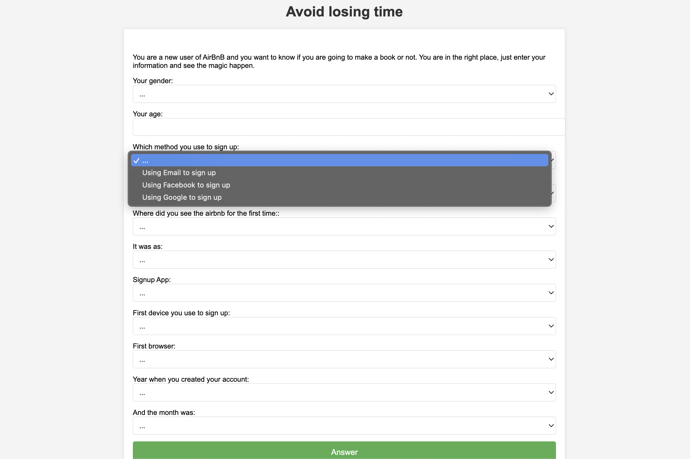
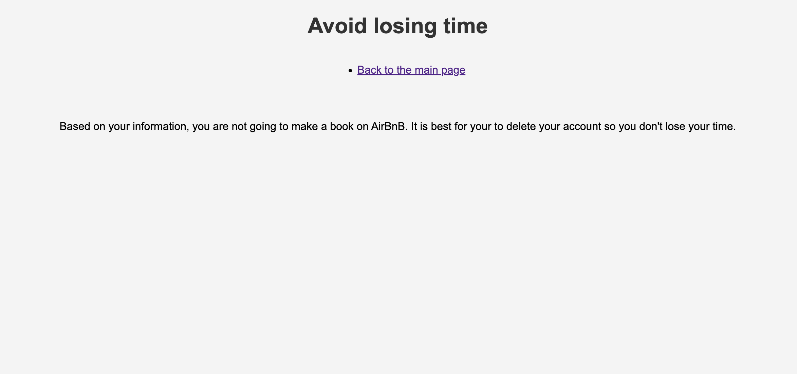
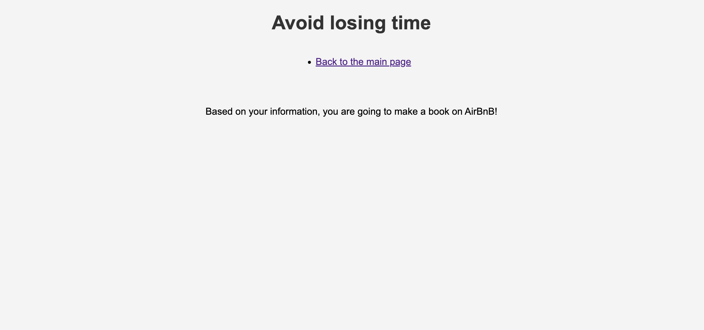

<div align="center">
    <h1># Where will users book their first travel destination?</h1>
</div>


## Introduction
Airbnb users have over 190 countries to choose from for their first booking. If we can accurately predict which country a new user will book their first trip in, it would allow Airbnb to provide more personalized through emails, on their homepage, and from third-party advertisers. They could also provide coupons to entice potential customers and decrease the amount of time customers wait before booking.

## Repository Structure
* **README.md**: The top-level README for reviewers of this project
* **app**:
    - **static**: This folder has datasets, imgages, css style.
    - **templates**: contains html files.
    - **app.py**: flask application.
    - **functions.py**: function used to process datasets.
    - **model.ipynb**: machine learning model. 
* **notebooks**:
    - **01.data_visualization_project_1.ipynb**: visualize train_users_2 dataset
    - **02.data_processing _project_1.ipynb**: First process the main dataset (basic information about users), then the sessions dataset that contains information about users' browsing.
    - **03.model_project_1.ipynb**: Try 3 algorithms and compare their scores.
    - **04.preparing_data_for_project_2.ipynb**: Prepare and correct the main dataset (train_users_2) for second project.

## Project 1:
The first project is a dataset about Airbnb users. The aim is to use it and predict which country new users will book her/his first destination. It is a kaggle competition.
The files of this project are `jupyter notebooks` in the notebooks folder.

## Project 2:
When I was processing the data in project one, I found that there is two types of users, those who booked and other who didn't. An idea came to my mind to build another model that will predict if a user will book in the first place or not. if he will then good, if not then tell the user that he is not going to book on Airbnb so it is best for her/his to delete the app and avoid wasting time scrolling.
The files of this project are: `04.preparing_data_for_project_2.ipynb` file in notebooks folder and the `app` folder.

 ## Requirements
In order to "run" the provided codes; jupyter notebook or vsCode.

## Getting the app running localy
1. Colone this repo
```
git clone https://github.com/khalidsbn/Users-destination.git
```
2. Create and activate a virtual environment
```
python3 -m venv .venv
source .venv/bin/activate
```
3. Install the required dependencies (pandas, Numpy, etc)
```
pip install -r requirements.txt
```
4. Change into the `app` directory
```
cd app
```
5. Run app.py

After ruinning the app.py you will see:




6. After entering your information about first login in Airbnb, you will get either:



or:



## Known issues
sessions.csv wasn't included in the data folder due to its huge size. 


